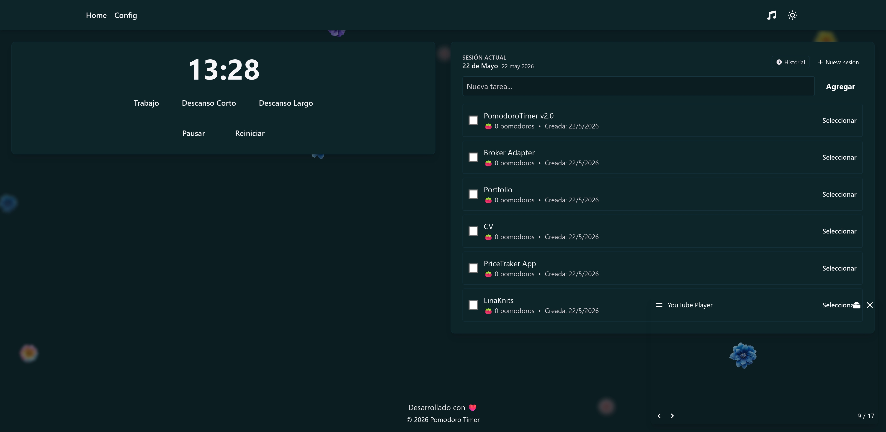
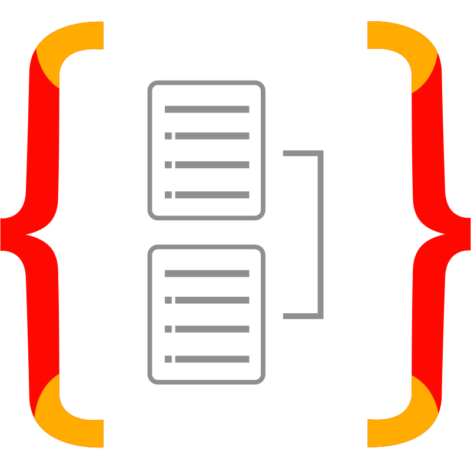
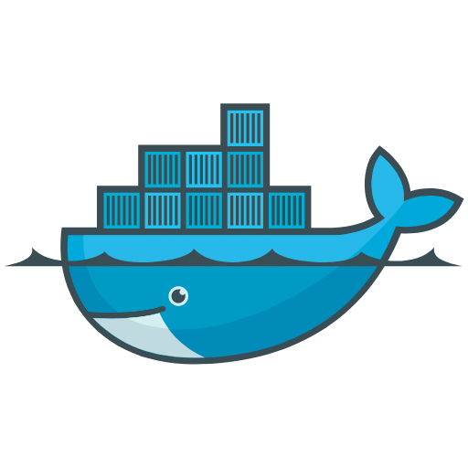

# Pomodoro Timer

Full-stack Pomodoro Timer application with task management, configurable timer presets, YouTube playlist integration and theme customization.

## Preview

<!-- Guardá los screenshots en docs/preview/ y referencialos acá -->


## Stack

### Frontend
- **React 18** + **TypeScript**
- **Vite 6** (dev server / bundler)
- **React Router DOM 6**
- **Tailwind CSS 4** + PostCSS / Autoprefixer
- **Axios** (HTTP client)
- **Nginx** (production static serving via Docker)

<!-- Guardá los logos en docs/stack/ y referencialos acá -->
<p align="left">
  
  
  
  
  
</p>

### Backend
- **NestJS 11** (Node.js framework)
- **TypeScript 5**
- **TypeORM 0.3**
- **MySQL 8** (`mysql2` driver)
- **@nestjs/event-emitter** (in-app events)
- **uuid**

<p align="left">
  
  
  
  
</p>

### Infrastructure
- **Docker** + **Docker Compose** (frontend, backend, MySQL)
- **MySQL 8** persisted via named volume

<p align="left">
  
  
</p>

## Modules

| Module      | Responsibility                                                   |
|-------------|------------------------------------------------------------------|
| `tasks`     | CRUD for user tasks linked to Pomodoro sessions                  |
| `timer`     | Timer lifecycle + per-user timer presets (work / break lengths)  |
| `sessions`  | Persists completed Pomodoro sessions for history / stats         |
| `playlist`  | YouTube playlist references played alongside the timer           |
| `seeder`    | Seeds initial data (default timer configs, demo tasks)           |
| `config`    | Centralized TypeORM / environment configuration                  |

## Getting Started

### Run with Docker (recommended)

```bash
docker compose up --build
```

- Frontend → http://localhost
- Backend  → http://localhost:3001
- MySQL    → localhost:3306 (db: `pomodoro_timer`, user: `root` / `root`)

The backend expects a `backend/.env` file (loaded by `env_file` in `docker-compose.yml`).

### Run locally (without Docker)

Backend:
```bash
cd backend
npm install
npm run dev        # nest start --watch
```

Frontend:
```bash
cd frontend
npm install
npm run dev        # vite
```

### Build for production

```bash
# Backend
cd backend && npm run build

# Frontend
cd frontend && npm run build
```

## Database

MySQL schema is bootstrapped via the SQL files in `backend/sql/`:
- `create_tasks_table.sql`
- `create_timer_configs_table.sql`

TypeORM entities live next to each module under `src/<module>/entities/`.

## Assets

```
docs/
├── preview/    # Screenshots de la app (preview.png, etc.)
└── stack/      # Logos del stack (react.png, nestjs.png, mysql.png, ...)
```
